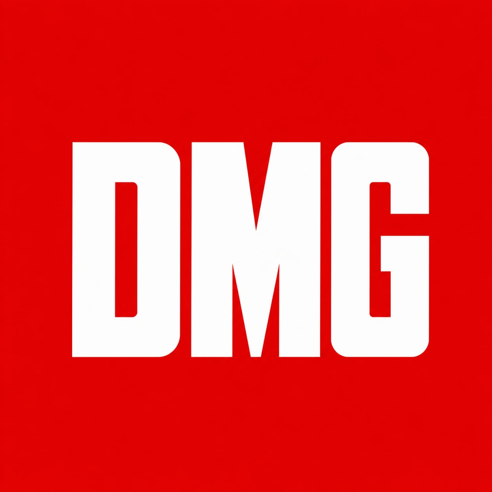
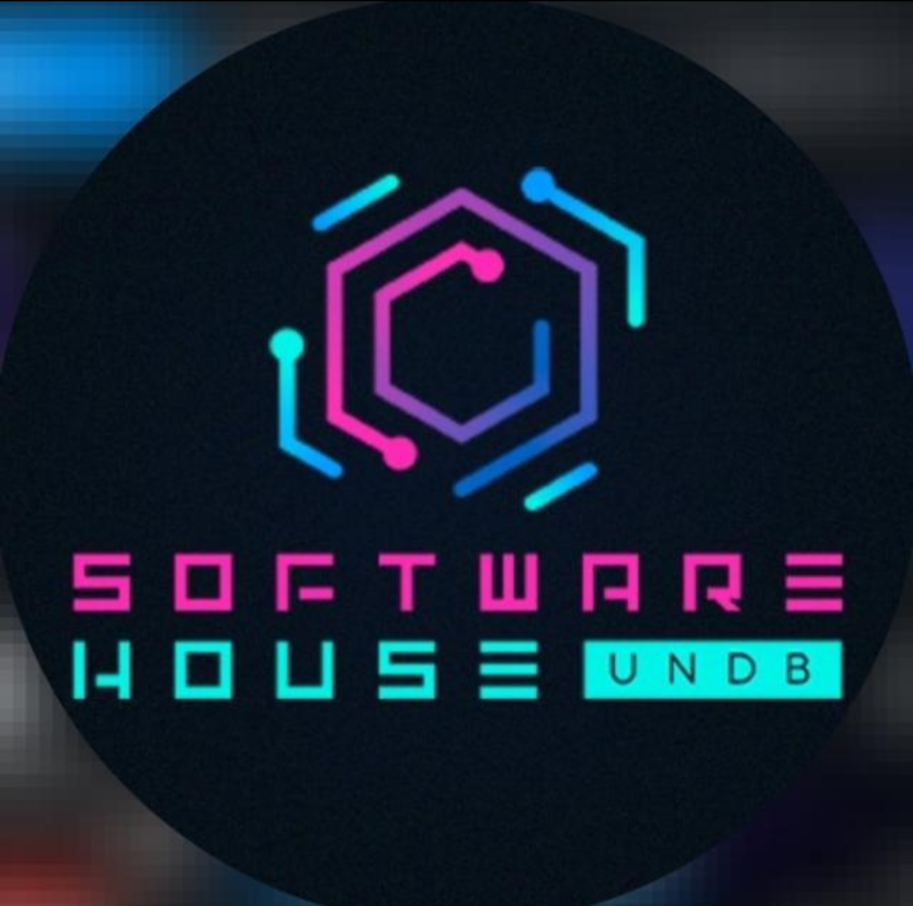
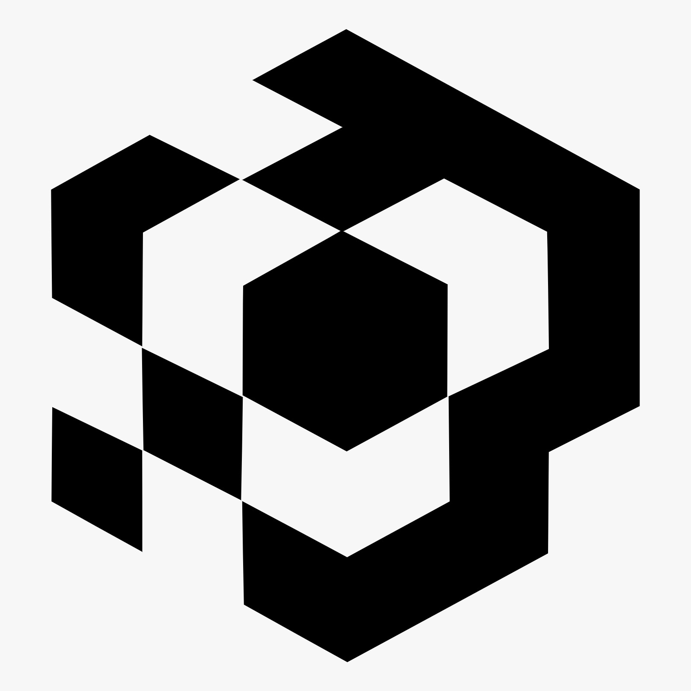
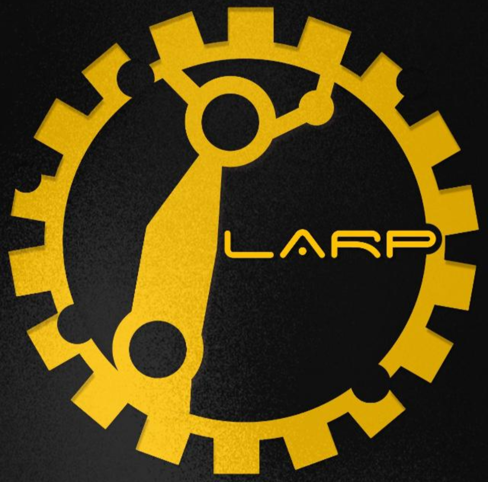

<div align="center">


<br/>

<a href="https://www.linkedin.com/in/miguel-victor-costa-de-almeida-vale-gomes-ab37b9353"></a>
<a href="https://instagram.com/miguel.victor.s"></a>


</div>

<br/>

## `>_` Sobre mim

```py
class Miguel:
    def __init__(self):
        self.handle    = "Sun_Akuma"
        self.formacao  = "Eng. de Software @ UNDB"
        self.papel_dmg = "Co-founder · CFO"
        self.ligas     = ["LADG", "LARP"]
        self.setup     = "Linux"
        self.foco      = "financeiro técnico + robótica + cibersegurança"

    def __repr__(self):
        return "Always On Top"
```

🏢 Co-fundador da **[DMG — Damage Group](#)**, atuando como **CFO** — finanças, infra e decisões técnicas do grupo
🎮 Ligante na **LADG** e gestor na **LARP** e na **SH**, dentro do ecossistema de ligas da UNDB
🤖 **Hardware e Robótica** — muito além de só código na tela
🐧 **Linux** no dia a dia
🔐 Trilha de **cibersegurança** em andamento, com foco em desenvolvimento na área

<br/>

## `>_` Stack

<div align="center">

**Linguagens**


**Frontend**


**Backend**


**Banco de dados**


**Infra / Cloud**


**Game Dev**


**Ferramentas**


</div>

<br/>

<details>
<summary align="center"><b>Mais Stack (clique pra abrir)</b></summary>

<br/>

<div align="center">

**Linguagens:**      

**Frontend:**   

**Backend:**  

**Banco de dados:**   

**Ferramentas:** 

</div>

</details>

<br/>


## `>_` Métricas

<div align="center">




<br/>



<br/>

</div>

> 🔧 *Essas 3 imagens são geradas pela Action `update-stats.yml` e salvas aqui no repo — não dependem do serviço externo estar no ar no momento em que alguém visita seu perfil.*

<br/>

## `>_` Contribution Snake

<div align="center">


</div>

> ⚠️ *Precisa de um GitHub Action rodando no seu repo de perfil — te passo o setup quando quiser.*

<br/>

---

## `>_` Organizações

<div align="center">


<br/><br/>



**Co-founder · CFO** — finanças, infraestrutura e decisões técnicas do grupo

- Um dos três fundadores, também atuando como Gerente de TI e Financeiro
- Grupo trabalha na própria sala da Software House (SH), dentro da UNDB
- Foco em desenvolver produtos próprios e prestar serviços de software para clientes reais


<br/><br/>


<br/><br/>



**Gestor** — escritório-escola da UNDB

- Alunos desenvolvem sites, apps e sistemas sob medida, incluindo clientes reais (ex: EMAP/Porto do Itaqui)
- Organização por squads de projeto, com formações internas (React Native + Expo, UX) e oficinas externas
- Realiza o IT Games (campeonato de Valorant) e o IT Works (ciclo de palestras)


<br/><br/>


<br/><br/>



**Ligante** — Liga Acadêmica de Desenvolvimento de Games, "Level Up Your Dreams"

- Criação de jogos do conceito à publicação: programação, arte, narrativa e gestão
- Organiza a UNDB GameJam e participa do IT Games e do Giro de Profissões
- Projeto de destaque: **"Caçadores de Verdades"**, jogo educativo sobre fake news levado a escolas públicas, com patrocínio do Governo do MA


<br/><br/>


<br/><br/>



**Gestor** — Liga Acadêmica de Robótica e Programação

- Projetos práticos de robótica, eletrônica e automação, com aulas internas ministradas pelos próprios membros
- Oficinas de Robô Sumô com LEGO Mindstorms/EV3, em parceria com Phoenix Robot/SESI
- Prêmio de melhor short paper no Encontro Científico UNDB, com pesquisa em robótica educacional


</div>

<br/>

---

<details>
<summary align="center"><b>Off Topic (clique pra abrir)</b></summary>

<br/>

<div align="center">


*"It's Hero Time."*

</div>

</details>

<br/>

<div align="center">


</div>
