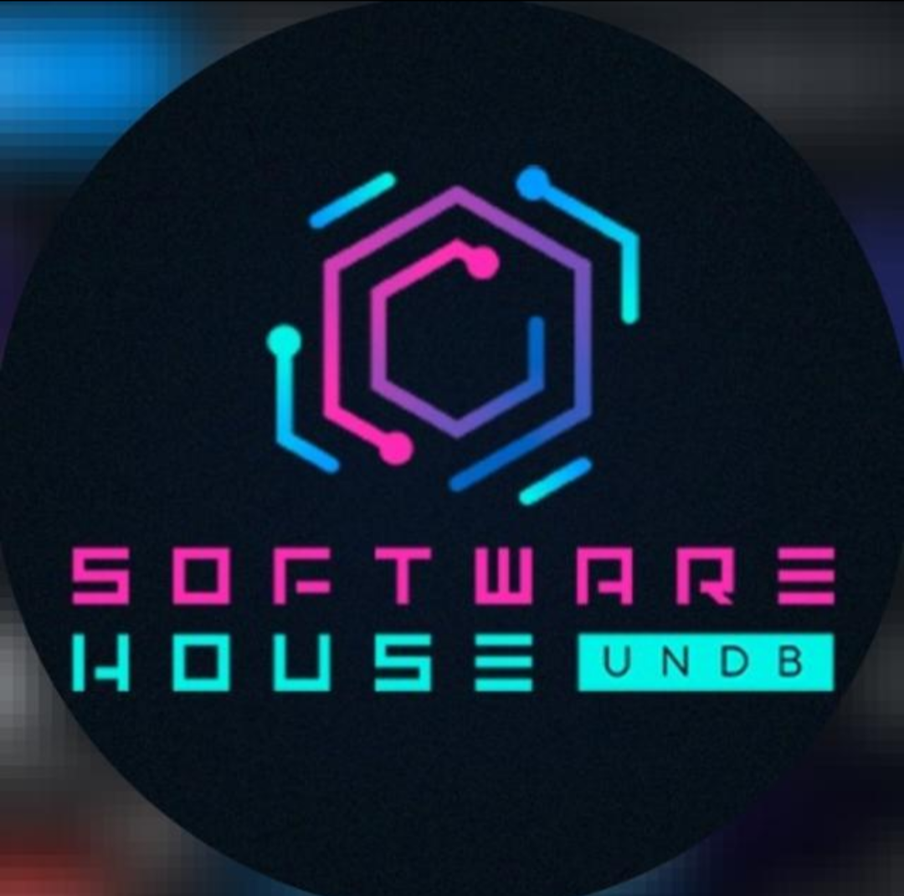
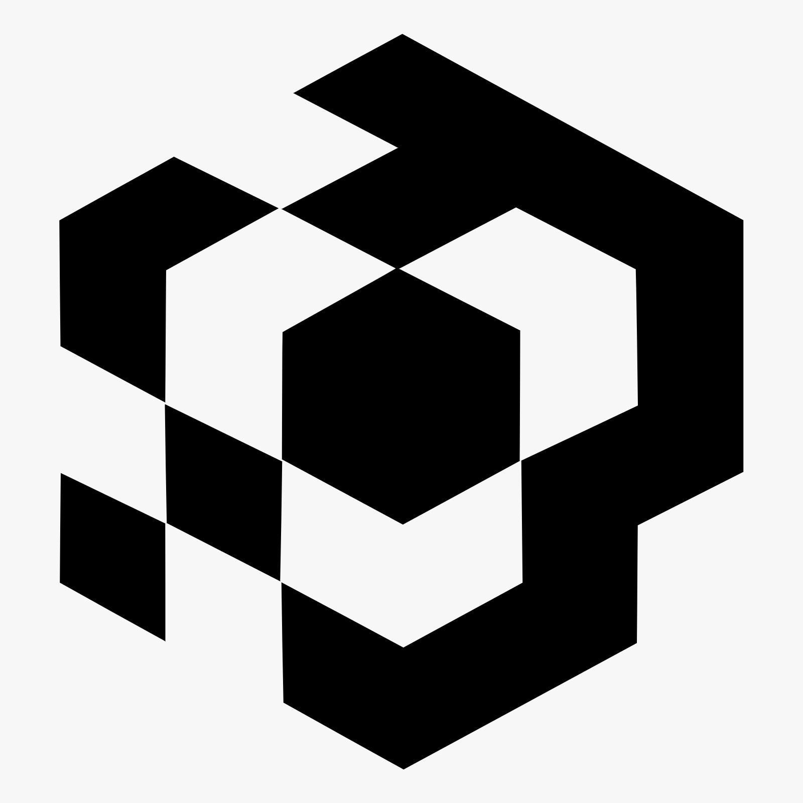
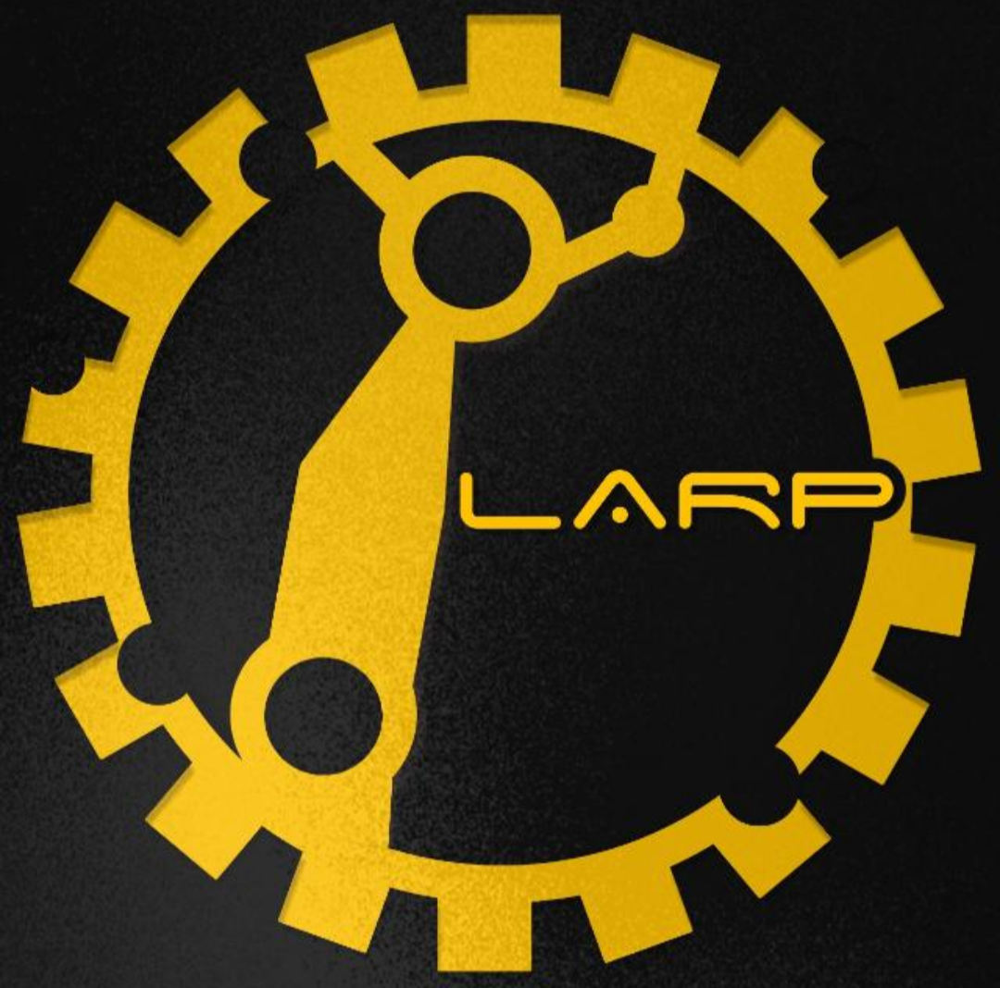

<div align="center">


<br/>

<a href="https://www.linkedin.com/in/miguel-victor-costa-de-almeida-vale-gomes-ab37b9353"></a>
<a href="https://instagram.com/miguel.victor.s"></a>


</div>

<br/>

## `>_` Sobre mim

```py
class Miguel:
    def __init__(self):
        self.handle    = "Sun_Akuma"
        self.formacao  = "Eng. de Software @ UNDB"
        self.orgs      = ["Software House", "LADG", "LARP"]
        self.setup     = "Linux"
        self.foco      = "full-stack + robótica + cibersegurança"

    def __repr__(self):
        return "Always On Top"
```

💻 Gestor e dev full stack na **Software House**, gestor geral e financeiro da **LARP** e ligante da **LADG**
🤖 **Hardware e Robótica** — muito além de só código na tela
🐧 **Linux** no dia a dia
🔐 Trilha de **cibersegurança** em andamento, com foco em desenvolvimento na área

<br/>

## `>_` Projetos em destaque

<div align="center">

### 🛍️ Amira Beauty — E-commerce

Loja virtual em produção desenvolvida para cliente pela DMG (Damage Group), grupo de desenvolvimento que cofundei.<br/>
Atuei no front-end, no back-end e nos testes dos fluxos de compra e checkout.


<a href="https://amirabeauty.com.br"></a>

<br/><br/>

### 🎯 IT Works UNDB — Plataforma de Gamificação

Plataforma de gamificação do IT Works, evento de palestras da Escola de Tecnologia da UNDB.<br/>
Desenvolvi toda a interface, responsiva em desktop e mobile.


<a href="https://itworks-undb.vercel.app"></a>

<br/><br/>

### 🎮 Sabotando Sanidade — Jogo Digital

🏆 **1º lugar em Jogos Digitais na UNDB GameJam 2026**<br/>
Jogo narrativo em que você é o vilão e precisa sabotar a recuperação de um personagem em depressão.<br/>
Fui o dev do jogo numa equipe de 4: programei as mecânicas e integrei a arte dos designers.


<a href="https://sun-akuma.itch.io/sabotando-sanidade"></a>
<a href="https://github.com/Miguel-doVale/Sabotando-A-Sanidade"></a>

<br/><br/>

### 🗳️ Washington Rio Branco 4343 — Site de Campanha

Site de campanha eleitoral feito para cliente, do desenvolvimento à publicação (domínio e deploy na Vercel).


<a href="https://washington-4343.vercel.app"></a>

</div>

<br/>

## `>_` Stack

<div align="center">

**Linguagens**


**Frontend**


**Backend**


**Banco de dados**


**Infra / Cloud**


**Game Dev**


**Ferramentas**


</div>

<br/>

<details>
<summary align="center"><b>Mais Stack (clique pra abrir)</b></summary>

<br/>

<div align="center">

**Linguagens:**      

**Frontend:**   

**Backend:**  

**Banco de dados:**   

**Ferramentas:** 

</div>

</details>

<br/>


## `>_` Métricas

<div align="center">




<br/>



<br/>

</div>

<br/>

## `>_` Contribution Snake

<div align="center">


</div>

<br/>

---

## `>_` Organizações

<div align="center">


<br/><br/>



**Gestor e Dev Full Stack** — empresa-escola de software da UNDB

- Gestão e desenvolvimento de sites, apps e sistemas para clientes reais, em squads por projeto
- Desenvolvi a interface da plataforma de gamificação do IT Works, evento de palestras da Escola de Tecnologia


<br/><br/>


<br/><br/>



**Ligante** — Liga Acadêmica de Desenvolvimento de Games, "Level Up Your Dreams"

- 🏆 **1º lugar** em jogos digitais na UNDB GameJam 2026 com o **Sabotando Sanidade**
- Monitor da **UNDB GameJam**
- Fundei a integração acadêmica entre as ligas de jogos da **UNDB, UFMA e CEUMA**


<br/><br/>


<br/><br/>



**Gestor Geral e Financeiro** — Liga Acadêmica de Robótica e Programação

- Gestão geral da liga: organização das atividades e dos membros
- Gestão financeira: controle dos recursos da liga


</div>

<br/>

---

<details>
<summary align="center"><b>Off Topic (clique pra abrir)</b></summary>

<br/>

<div align="center">


*"It's Hero Time."*

</div>

</details>

<br/>

<div align="center">


</div>
